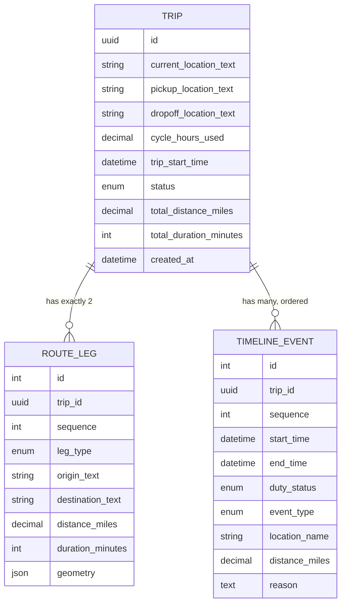
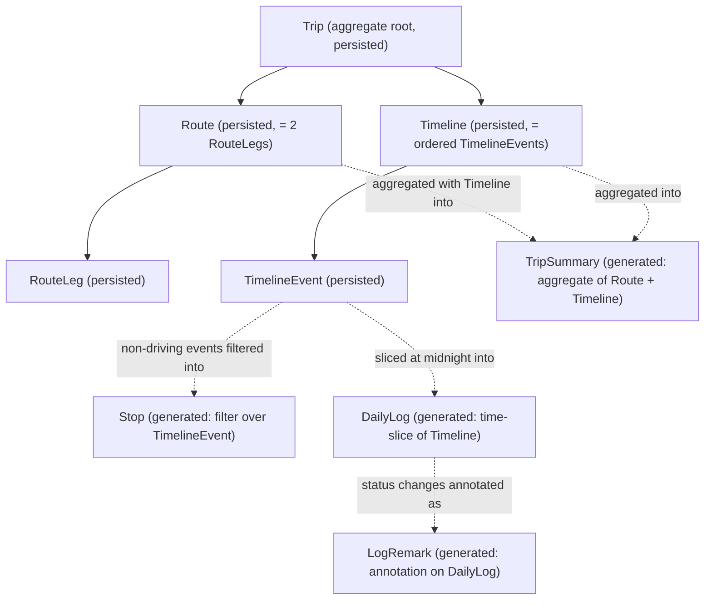
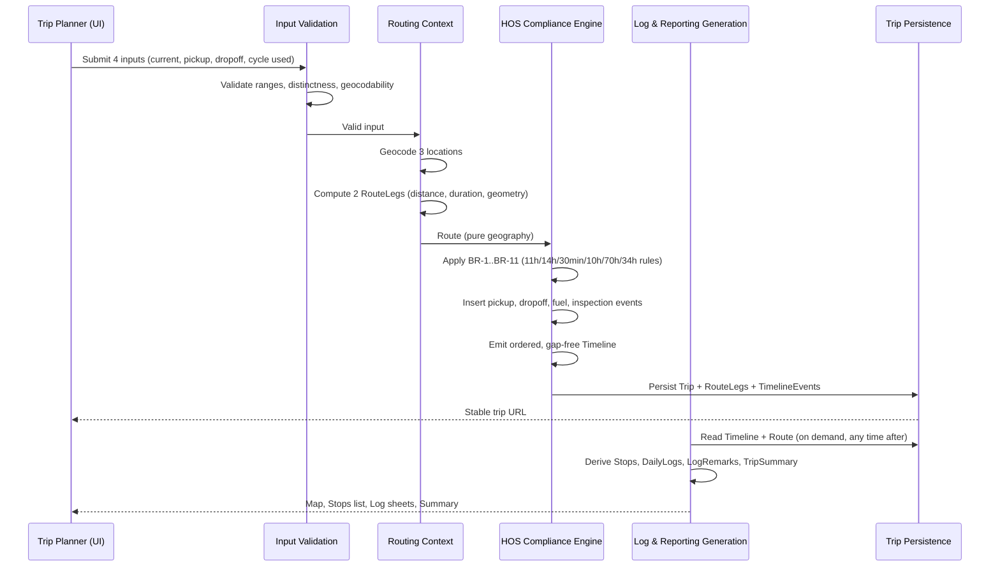

# Domain Analysis — Truck Trip Planner & ELD Log Generator

**Phase:** 2A — Domain Modeling Only
**Status:** Draft for review before Phase 2B
**Scope:** Business domain analysis only. No Django models, no migrations, no APIs, no business logic, no frontend components were created or modified as part of this phase.

---

## 1. Domain Overview

**What software are we building?**

A single-page web application that converts four inputs — current location, pickup location, dropoff location, and hours already used in the driver's current 70-hour/8-day cycle — into a complete, federally-compliant truck trip plan: a routed map, a chronological schedule of duty statuses, and a set of FMCSA-format Driver's Daily Log sheets (one per calendar day of the trip).

**What problem does it solve?**

Planning a multi-day truck trip under 49 CFR Part 395 (Hours of Service) requires reasoning about several interacting time limits — an 11-hour driving cap, a 14-hour on-duty window that doesn't pause for breaks, a 30-minute break triggered by *cumulative* (not consecutive) driving, a rolling 70-hour/8-day cycle, and fixed pickup/dropoff/fueling durations. Today this is done by hand, with a mapping tool for distance and a mental model of the regulation for everything else. The rules interact non-obviously enough that a plan can be illegal before the truck moves. This product performs that reasoning mechanically and renders the result in the log format the industry already recognizes.

**Who is the intended user?**

One role: the **Trip Planner** — a dispatcher, an owner-operator, or an operations coordinator — the person who decides when a truck leaves and where it stops. They are accountable for a delivery commitment, know trucking vocabulary but not the text of 49 CFR, and work under time pressure planning multiple trips per session.

**Why does this product exist?**

Because the tools on either side of this problem don't solve it: routing tools (Google Maps, PC*Miler) compute distance and drive time but know nothing about HOS; ELD platforms (Samsara, Motive, KeepTruckin) record compliance after the fact but don't plan ahead of it, and require fleet hardware/subscriptions. Nothing takes four inputs and returns a compliant plan plus printable logs with zero setup.

**Explicit framing constraint:** this product is a *planning* tool, not an Electronic Logging Device. It projects what a driver *should* do; it does not record what a driver *actually* did. Every output artifact must be visibly labeled as a planning projection, not an official record (NG1, A-26, BR-... via FR-6.11).

---

## 2. User Analysis

### 2.1 Actors identified

| Actor | Responsibilities (if included) | In V1? | Why / Why not |
|---|---|---|---|
| **Trip Planner / Dispatcher** | Enters trip inputs, reads the generated plan, distributes logs to a driver | **Yes** | The only actor the requirements describe. Every user story (US-1–US-32) is written from this actor's point of view. Nothing in the brief implies a second role. |
| **Driver** | Would execute the plan, record actual duty status | **No** | The driver is *implicit* in the trip (their hours and their log sheets), but the driver never operates the software. No login, no data entry, no live status recording is in scope (NG5, NG7 for team drivers). Modeling a Driver entity would require identity, credentials, and a real-time data feed — none of which the brief implies. |
| **Enforcement officer / DOT auditor** | Would inspect actual duty records | **No** | Explicitly out of scope (Section 6). They need certified records, not projections; serving them would misrepresent the product as an ELD (R-17, NG1). |
| **Safety/compliance manager** | Would audit fleet-wide compliance | **No** | Requires a fleet concept, which doesn't exist in v1 (NG3). |
| **Software developer (API consumer)** | Would integrate the planning engine programmatically | **No** | No public API is scoped for v1 (OQ-16 defers this). The generation endpoint exists for the UI only. |
| **System/Admin** | Would manage users, permissions, configuration | **No** | With one unauthenticated role and no accounts, there is nothing to administer (NG4). |

### 2.2 Justification for excluding authentication, admin, organizations, drivers, and fleets

- **Authentication:** Excluded (NG2, A-22). The requirements describe a single workflow with no ownership semantics — nobody's data needs to be kept from anybody else. Trips are shareable-by-URL specifically *because* there is no concept of an owner (A-2). Adding auth now would consume build effort without resolving any stated requirement, and — per NFR-5.1/5.3 — the architecture is kept modular specifically so auth can be added later without touching the HOS engine or routing layer.
- **Admin panel / roles:** Excluded (NG4). Role-based permissions have no meaning without at least two distinguishable roles or an ownership boundary; neither exists.
- **Organizations / multi-tenancy:** Excluded (NG3). No entity in the four required inputs implies a company, carrier, or account boundary. Introducing one would be speculative modeling — the exact anti-pattern this phase is designed to avoid.
- **Drivers (as an entity):** Excluded. The "driver" is a *role implied by the plan*, not a record the system stores or identifies. The only driver-specific fact the system needs — hours already used in the current cycle — is already a first-class input (`Current Cycle Used`). Adding a Driver entity would require a name, an identity, and a lifecycle that nothing in the requirements populates.
- **Fleets / Vehicles:** Excluded (NG3). No vehicle attributes (fuel capacity, height, weight) are inputs; the fuel interval and inspection durations are fixed *policy constants* (BR-19–22), not vehicle-derived data. A fleet requires multiple vehicles/drivers under one owner — an ownership concept v1 deliberately does not have.

**Assumption A-1 (restated):** exactly one user role — Trip Planner — is modeled. This is stated directly in the PRD (Section 6, Assumption A-1) and confirmed by the absence of any second role across 32 user stories.

---

## 3. Entity Discovery

Each candidate entity below is evaluated on purpose, owner, lifecycle, relationships, and whether it is persistent (stored) or generated (computed on demand, never stored).

### 3.1 Trip

- **Purpose:** The root of the domain. Represents one planning request and the complete result of running it through the pipeline.
- **Owner:** The Trip Planner (informally — there is no ownership *field*, since there is no account to own it).
- **Lifecycle:** `submitted` → `routing` → `planned` → `persisted` (retrievable by stable URL). Never `edited` — a changed input produces a new Trip via regeneration (A-24), not a mutation of an existing one.
- **Relationships:** has exactly one Route, one Timeline, one TripSummary (derived); has many DailyLogs (derived).
- **Persistent or generated:** **Persistent.** This is the one entity that must survive a page refresh (FR-9.1, FR-9.2) and be the anchor everything else hangs off.

### 3.2 Route

- **Purpose:** The geographic path the truck will travel, as returned by the routing provider — pure geography, no time or duty-status information.
- **Owner:** Trip (1:1 — every Trip has exactly one Route).
- **Lifecycle:** Computed once at generation time from three geocoded points; immutable afterward.
- **Relationships:** belongs to a Trip; composed of exactly two RouteLegs (current→pickup, pickup→dropoff), per BR-23.
- **Persistent or generated:** **Persistent**, because re-deriving it means calling the routing provider again — expensive, rate-limited (R-7), and non-deterministic if the provider's data changes between requests. Persisting it is what makes NFR-1.1 (<10s) and FR-9 (stable, refreshable results) both achievable without re-hitting the provider on every view.

### 3.3 RouteLeg

- **Purpose:** One segment of the route between two named waypoints — `current → pickup` (deadhead) or `pickup → dropoff` (loaded).
- **Owner:** Route.
- **Lifecycle:** Computed with the Route; immutable.
- **Relationships:** belongs to a Route (exactly two per trip, always).
- **Persistent or generated:** **Persistent**, for the same reason as Route. Kept as a distinct entity (not flattened into Route) because the two legs carry different business meaning — this leaves room for future deadhead-cost or loaded-mile reporting (Section 24) without restructuring.

### 3.4 Timeline

- **Purpose:** The complete, ordered, time-stamped schedule of what the driver does from trip start to delivery completion. **This is the heart of the domain model.**
- **Owner:** Trip (1:1).
- **Lifecycle:** Produced once by the HOS Compliance Engine from Route + cycle-used input; immutable afterward (consistent with A-24 — no partial regeneration).
- **Relationships:** belongs to a Trip; composed of an ordered sequence of TimelineEvents.
- **Invariant:** events are contiguous, non-overlapping, and cover the entire trip with zero gaps (FR-4.1, AC-17, AC-18).
- **Persistent or generated:** **Persistent.** Everything else the user sees — map, stops list, summary, log sheets — is a *read projection* of the Timeline. Nothing else independently decides "what happens when." This is the single most important modeling decision in the domain: correctness lives in one place.

### 3.5 TimelineEvent

- **Purpose:** One contiguous block of a single duty status — e.g., "07:00–11:30, Driving, en route to pickup."
- **Owner:** Timeline.
- **Lifecycle:** Created once, in sequence, by the engine; immutable.
- **Relationships:** belongs to a Timeline; ordered by `sequence` or `start_time`.
- **Fields:** start time, end time, duty status (one of Off Duty / Sleeper Berth / Driving / On Duty-Not-Driving), event type (Drive / Pickup / Dropoff / Fuel / Rest Break / Daily Rest / Cycle Restart / Pre-Trip Inspection / Post-Trip Inspection), location (coordinates + resolved place name), distance covered (if driving), and a mandatory human-readable `reason`.
- **Persistent or generated:** **Persistent.** This is the atomic unit of truth. Every other output (Stop, DailyLog, LogRemark, TripSummary) can be recomputed from a sufficiently complete set of TimelineEvents, so this is the *minimum* data that must be stored to make results reproducible without re-running the planning engine.

### 3.6 Stop

- **Purpose:** A non-driving TimelineEvent that has a geographic location the user cares about — something to show as a marker on the map or a row in the itinerary.
- **Owner:** Conceptually owned by Timeline, but it is not a separate record of truth — it is a *filtered view* over TimelineEvents (all events except plain Driving segments).
- **Lifecycle:** N/A — computed at read time, every time it's needed.
- **Relationships:** derived from TimelineEvent 1:1 (each qualifying event *is* a stop).
- **Persistent or generated:** **Generated.** Storing it separately would create a second source of truth that could drift from the Timeline. It exists as a named concept purely so the map and itinerary consumers don't each reimplement "which events count as stops" — that filter belongs in the domain, not duplicated in the UI.

### 3.7 DailyLog

- **Purpose:** One calendar day's worth of the Timeline, rendered in Driver's Daily Log (RODS) form.
- **Owner:** Conceptually owned by Trip, but derived from Timeline.
- **Lifecycle:** Computed by slicing the Timeline at midnight boundaries; events spanning midnight are split across two DailyLogs (BR-32, EC-27).
- **Relationships:** one Trip has N DailyLogs, where N = number of calendar days spanned (BR-32).
- **Invariant:** per-status totals sum to exactly 24.0 hours (BR-28, AC-28) — computed from exact TimelineEvent times, never from the visual 15-minute grid cells (EC-32).
- **Persistent or generated:** **Generated.** It is a pure, deterministic function of Timeline + calendar-day boundary. Storing it would mean maintaining a derived cache that must be invalidated whenever the Timeline changes — unnecessary, since Trips are immutable after generation (A-24) and the computation is cheap (<1s per NFR-1.4).

### 3.8 LogRemark

- **Purpose:** A single annotation on a DailyLog — "12:30 PM — Effingham, IL — Fuel stop."
- **Owner:** DailyLog.
- **Lifecycle:** Generated at every duty-status change within a day (BR-29).
- **Relationships:** many per DailyLog; each corresponds to a TimelineEvent boundary.
- **Persistent or generated:** **Generated**, for the same reason as DailyLog — it is a formatting/annotation view over TimelineEvent boundaries, not new information.

### 3.9 TripSummary

- **Purpose:** The headline metrics a user reads first — total distance, driving hours, elapsed duration, projected arrival, day count, stop counts, cycle accounting, restart flag.
- **Owner:** Trip.
- **Lifecycle:** Computed once from Route + Timeline at generation time (or at read time — either is valid since both inputs are immutable).
- **Relationships:** 1:1 with Trip.
- **Persistent or generated:** **Generated.** It holds no independent truth — every field is an aggregate over Route and Timeline. Whether it's cached on write or computed on read is an implementation choice with no domain consequence (noted as a scalability lever in Section 9).

### 3.10 Entities considered and deliberately excluded

| Candidate | Why it does not exist as a domain entity |
|---|---|
| **User / Account** | No authentication in v1 (A-22); see Section 2.2. |
| **Driver** | No driver identity is captured anywhere in the four inputs; the driver is implicit. See Section 2.2. |
| **Vehicle / Truck / Trailer** | Not an input. Log sheet fields for these stay blank for manual completion (OQ-14). Fuel/inspection durations are policy constants, not vehicle attributes. |
| **Carrier / Organization** | No multi-tenancy (NG3); nothing to scope trips to. |
| **Load / Shipment / Commodity** | Not an input; no routing restriction (hazmat, weight) is modeled (NG11). |
| **DutyStatusRecord** | Rejected specifically because it *sounds like* an actual compliance record. This product produces projections, not records (NG1) — naming an entity this way would blur the single most important product boundary. `TimelineEvent` is the correct, honestly-scoped name. |

---

## 4. Entity Justification

| Entity | Why should it exist? | Could it be removed? | Would removing it violate requirements? |
|---|---|---|---|
| **Trip** | Needed as the addressable, persistable unit — the thing a URL points to (FR-9.2). | No. | Yes — without it, nothing is retrievable or shareable (FR-9, F11). |
| **Route** | Separates "where" from "when." The HOS engine must consume distance/duration without knowing about geocoding, and the routing provider must be swappable (NFR-5.3) without touching the engine. | In theory, could be inlined into Trip as flat fields. | Not a requirements violation, but it would couple two concerns (geography vs. schedule) that the requirements explicitly ask to be decoupled (FR-3.11, NFR-5.1, NFR-5.3). Kept separate on architectural merit. |
| **RouteLeg** | Distinguishes deadhead (current→pickup) from loaded (pickup→dropoff) travel — different business meaning per BR-23. | Could be flattened into two fields on Route (`leg1`, `leg2`). | No violation either way; kept as a list of two for symmetry with Timeline's list-of-events shape and to keep the "exactly two legs" invariant (BR-23) enforceable as a collection constraint rather than a naming convention. |
| **Timeline** | The single source of truth every other output reads from (FR-4, F5). | No. | Yes — FR-4.1 requires a chronologically ordered, gap-free event sequence to exist as an addressable artifact; removing it would force every consumer (map, log, summary) to independently reconstruct the schedule, multiplying the risk surface for R-1 (subtly wrong HOS logic). |
| **TimelineEvent** | The atomic, auditable unit — "why is there a stop here?" (US-9, US-22) is answered by reading one event's `reason` field. | No. | Yes — FR-4.2 requires every event to carry a reason; this is the mechanism for NFR-3.5 (legibility) and G4 (make the plan legible, not just correct). |
| **Stop** | Gives the map and itinerary a shared, pre-filtered vocabulary ("things with a location worth marking") instead of each reimplementing the filter. | Yes, as a *stored* entity — it was never proposed as one. As a *named view*, removing it just pushes the filter logic into the UI layer, which is a maintainability regression, not a requirements violation. | No functional violation; a code-quality regression only. |
| **DailyLog** | Required as an addressable "one sheet per day" concept because FR-6.1 and BR-32 require exactly N sheets for an N-day trip. | Could be computed inline at render time with no named intermediate object. | No violation if computed correctly, but naming it makes the "sum to 24 hours" invariant (BR-28) independently testable — valuable given NFR-2.1 (zero rule violations) and R-5 (log totals not summing to 24 is an explicitly identified risk). |
| **LogRemark** | Required by BR-29 — every duty status change must be annotated with city/state/activity. | Could be an unstructured string. | Modeling it as a small structured object (time, city, state, activity) is what makes AC-29 machine-checkable rather than merely eyeballed. |
| **TripSummary** | Directly serves G2/G4 — answering "when will it be there?" in the first 5 seconds (NFR-3.2). | Yes, trivially — it's a read-time aggregation with zero independent state. | No violation regardless of whether it's a named object or an inline API response shape. Named here because F9/FR-7 treat it as a first-class output. |

---

## 5. Candidate Database Tables

No Django models are created in this phase; the following is the conceptual schema Phase 2B would implement, and the reasoning for each table's existence.

### 5.1 Tables that must be persisted

| Table | Why it exists as a table (not a computed view) |
|---|---|
| **trip** | The root aggregate. Must survive a page refresh and be retrievable by a stable identifier (URL) per FR-9.1/9.2. Holds the four raw inputs (current/pickup/dropoff location text, cycle hours used), the resolved trip start time, a generation status/timestamp, and — for read efficiency — cached top-level Route aggregates (total distance, total duration) so the summary doesn't require joining every leg on every read. |
| **route_leg** | Persisting the routing provider's response (distance, duration, geometry, resolved endpoint names) avoids a second network call to the provider on every page view — critical given R-7 (rate limits) and R-9 (provider unavailability). Exactly two rows per trip, ordered by sequence, distinguished by leg type (deadhead vs. loaded). Geometry stored as a serialized path (e.g., an encoded polyline or a JSON coordinate array); this is the one field that is naturally document-shaped rather than relational. |
| **timeline_event** | The atomic record of truth (see 3.5). Must be persisted because every other output — map markers, stops list, log sheets, summary — needs to be re-derivable without re-running the HOS engine. One-to-many from trip, ordered by sequence/start_time. Columns: trip_id (FK), sequence, start_time, end_time, duty_status (enum), event_type (enum), location_name, latitude, longitude, distance_miles (nullable — only meaningful for driving events), reason (text, non-nullable per FR-4.2). |

### 5.2 Tables deliberately not created

| Would-be table | Why it's not a table |
|---|---|
| **daily_log** | Fully derivable from `timeline_event` by slicing on midnight boundaries (3.7). Storing it would create a cache that must stay in sync with `timeline_event` for no benefit, since Trips are immutable after generation and the derivation is cheap (<1s, NFR-1.4). |
| **log_remark** | Derivable from `timeline_event` boundaries within a `daily_log` slice (3.8). Same reasoning as above. |
| **trip_summary** | A pure aggregation over `route_leg` + `timeline_event` (3.9). No independent state to store. |
| **stop** | A filtered view over `timeline_event` (3.6). Storing it duplicates rows already in `timeline_event`. |
| **route** (as separate from `route_leg`) | Route-level aggregates (total distance, total duration) are either summed from its two `route_leg` rows at read time or cached directly on `trip` — introducing a standalone `route` table for a 1:1, no-independent-fields relationship adds a join with no informational gain. |

### 5.3 Schema shape (conceptual, not implementation)

```
trip
  id (PK, UUID — used as the shareable URL token)
  current_location_text, pickup_location_text, dropoff_location_text
  cycle_hours_used (decimal)
  trip_start_time
  status (enum: pending | planned | failed)
  failure_reason (nullable)
  total_distance_miles, total_duration_minutes   -- cached Route aggregate
  created_at

route_leg
  id (PK)
  trip_id (FK -> trip)
  sequence (1 or 2)
  leg_type (enum: deadhead | loaded)
  origin_text, destination_text
  origin_lat, origin_lng, destination_lat, destination_lng
  distance_miles, duration_minutes
  geometry (serialized path)

timeline_event
  id (PK)
  trip_id (FK -> trip)
  sequence (int, defines order)
  start_time, end_time
  duty_status (enum: off_duty | sleeper_berth | driving | on_duty_not_driving)
  event_type (enum: drive | pickup | dropoff | fuel | rest_break_30 | daily_rest_10 | cycle_restart_34 | pretrip_inspection | posttrip_inspection)
  location_name, latitude, longitude
  distance_miles (nullable)
  reason (text, not null)
```

This is intentionally three tables. `trip` is the aggregate root and the only externally addressable identity; `route_leg` and `timeline_event` exist purely to avoid re-calling the routing provider and re-running the engine on every read.

---

## 6. Generated Objects

Objects that must **never** be stored permanently, and why:

| Object | Why it stays generated |
|---|---|
| **Stop** | A filter over `timeline_event`, not new data. Persisting it would be redundant storage that can silently drift from the Timeline it's supposed to represent. |
| **DailyLog** | A time-sliced view over `timeline_event`. Persisting it duplicates data and creates an invalidation problem for no performance benefit (derivation is already sub-second). |
| **LogRemark** | A formatting artifact of DailyLog/TimelineEvent boundaries — same reasoning. |
| **TripSummary** | A pure aggregation with zero fields not derivable from `trip` + `route_leg` + `timeline_event`. |
| **The rendered log-sheet SVG/graph grid itself** | A presentation artifact of DailyLog. Regenerating pixels from data is always correct; storing rendered output risks the rendering going stale relative to a rule change (R-19) or a rendering-code fix. |
| **The rendered map viewport/polyline drawing** | Same reasoning — derived from `route_leg` geometry at render time. |
| **Validation error messages** | Purely transient, request-scoped; never associated with a Trip once resolved (a failed *submission* never becomes a persisted Trip — see `trip.status = failed` for the one case worth recording, which is a *diagnostic*, not a domain object). |

The unifying principle (DDD terms): **Timeline is the single aggregate of record for "what happens when"; everything downstream is a query/projection, not a separate write model.** This is also why the architecture supports CQRS-style read models later (Section 10) without any restructuring — those read models would simply be cached versions of objects that are today generated on every request.

---

## 7. Domain Relationships

### 7.1 Entity-Relationship Diagram (persisted tables only)



### 7.2 Object Relationship Diagram (full conceptual model, including generated objects)



### 7.3 Domain Flow (the planning pipeline)



---

## 8. Aggregate Roots

**Trip is the sole aggregate root in this domain.**

Reasoning:

- **Single transactional boundary.** A Trip, its RouteLegs, and its TimelineEvents are created together, atomically, as one act of generation (F5, FR-4.1's gap-free invariant only makes sense if the whole Timeline commits together). Nothing outside the Trip aggregate can be independently modified once generation succeeds (A-24 — trips are regenerated, not edited).
- **No independent identity or lifecycle for its members.** A RouteLeg or TimelineEvent is never looked up, created, or deleted except as part of its owning Trip. Neither has a URL, a list endpoint, or a reason to exist detached from a Trip.
- **Invariants that must hold across the whole cluster.** "Events are contiguous and gap-free" (FR-4.1), "legs are exactly two, in fixed order" (BR-23), and "cumulative on-duty time never breaches 70 hours without a 34-hour restart" (BR-8..11) are all invariants that span multiple child records and can only be enforced by treating the collection as one consistency boundary — the textbook definition of an aggregate.
- **External addressability stops at Trip.** The only stable, shareable identifier in the system is the Trip's URL (FR-9.2). Nothing else is retrievable independently, which is the aggregate-root litmus test: if it's not separately addressable from outside, it's not a root.

Route, RouteLeg, Timeline, and TimelineEvent are all **aggregate members**, not roots. Stop, DailyLog, LogRemark, and TripSummary are not part of the aggregate at all — they are **read-model projections** computed over it and have no place in a write-side consistency discussion.

---

## 9. Bounded Contexts

| Context | Responsibility | Talks to | Notes |
|---|---|---|---|
| **Trip Intake** | Captures and validates the four raw inputs (FR-1, FR-10.4). Owns the field-level validation matrix (Section 15.4 of the PRD) and the plain-language error vocabulary (FR-10). | Routing Context (hands off validated input) | Thin context — mostly a guard in front of the pipeline. Could be folded into an API/application layer rather than a "domain" context proper, but kept distinct because its rules (range checks, distinctness) are business rules, not incidental UI logic. |
| **Routing** | Turns place-text into geocoded points and geocoded points into a two-leg route with distance/duration/geometry (FR-2). Owns the provider interface so the provider is swappable (NFR-5.3). Knows nothing about HOS, duty statuses, or time budgets. | External routing/geocoding provider (outbound); HOS Planning (provides Route as input) | Explicitly "pure geography" per the PRD's own note on Route (17.2). This isolation is what makes R-7/R-8 (provider risk) containable — a provider swap touches only this context. |
| **HOS Compliance Engine (Planning)** | The domain's core and its "durable asset" (PRD Section 3). Consumes a Route + cycle-hours-used and applies BR-1 through BR-37 to emit a Timeline. Framework-, database-, and provider-independent (NFR-5.1, FR-3.11) — it is pure business logic over plain data. | Routing (consumes its output); Log & Reporting (its output is consumed by) | Deliberately the most protected context. NFR-5.2 requires every regulatory constant to live here, in one place, cross-referenced to its CFR section. This is the context an independent validator (R-1's mitigation) checks against. |
| **Log & Reporting Generation** | Projects the Timeline (+ Route) into every user-facing output: Stops, DailyLogs, LogRemarks, TripSummary, the rendered map, and the rendered FMCSA-format log sheets (FR-4 outputs through FR-8). | HOS Planning (reads Timeline); UI (serves it) | A read-side/query context in CQRS terms — it never writes back to the Timeline. Splitting map-rendering, log-rendering, and summary-computation into separate sub-contexts is a UI/implementation concern, not a domain one; at the domain level they are one "make the Timeline legible" responsibility. |
| **Trip Persistence** | Stores the Trip aggregate (Trip + RouteLegs + TimelineEvents) and retrieves it by stable identifier (FR-9). A generic/supporting context — it has no domain vocabulary of its own beyond "save and fetch this aggregate." | All other contexts (each may trigger a save or a read) | Kept as its own context specifically because it is the seam where multi-tenancy/ownership would be introduced later (Section 10) without touching HOS logic. |

**Context map shape:** Trip Intake → Routing → HOS Planning → Log & Reporting, a linear pipeline, with Trip Persistence as a cross-cutting supporting context invoked at the end of the write path and the start of every read path. There is no context that both HOS Planning and Routing need to share a model with beyond the Route/Timeline handoff objects themselves — which is exactly what NFR-5.1 and NFR-5.3 require.

---

## 10. Future Scalability

The v1 architecture — a framework-independent rule engine, a provider-independent routing interface, and a Timeline as the single source of truth — is designed so each of the following is an **addition**, not a rewrite (this mirrors the PRD's own framing in Section 24):

- **Authentication.** Add a `user` table and an `owner_id` (nullable, for backward compatibility with anonymous trips) on `trip`. No context needs to change: Trip Intake still validates the same four fields; HOS Planning never knew about ownership; Trip Persistence gains a `WHERE owner_id = ?` filter. The URL-based sharing model (A-2) can coexist with ownership indefinitely — "shareable by URL" and "owned by an account" are orthogonal.
- **Drivers (as an entity).** Add a `driver` table and a nullable `driver_id` on `trip`. The engine's only driver-relevant input today is `cycle_hours_used`, a scalar — introducing a Driver entity would let that scalar be *looked up* from the driver's last known state instead of typed in each time, without changing the engine's signature at all (it still receives a number).
- **Vehicles.** Add a `vehicle` table; let it *parameterize* today's fixed constants (fuel interval, inspection durations) instead of hardcoding them — this is explicitly foreshadowed in the PRD's "configurable pickup/dropoff and fuel durations" future improvement (Section 24.1). The HOS Compliance Engine's rule set (11h/14h/30min/70h/34h) is federal and vehicle-agnostic, so it never needs to know a Vehicle exists.
- **Fleets / Organizations / Multi-tenancy.** Add `organization` and `fleet` tables above `driver`/`vehicle`/`user`, with `organization_id` propagating down as a scoping filter at the Trip Persistence context only. Because Trip is already the sole aggregate root and the only externally addressable entity, multi-tenancy is a single-context change (add a tenant filter to Trip Persistence's queries) rather than a cross-cutting one.

In every case, the shape of the change is the same: **a new entity gets introduced upstream of Trip Intake or alongside Trip Persistence, and it flows into the pipeline as an additional input or a scoping filter — it never requires opening up the HOS Compliance Engine.** That containment is the entire point of keeping the engine "pure Python, unit-testable, with no Django or network dependency" (PRD G6) and is the single most important architectural property Phase 2B must preserve.

---

## Summary

### Architecture observations

- Phase 1 delivered exactly what it claimed: a Django/DRF + React/Vite skeleton with one health-check endpoint, no domain code, no models. This is a clean foundation with nothing to unwind before Phase 2B.
- The PRD is unusually explicit about domain boundaries already (its own Section 17 sketches the entity list and Section 24 sketches the extension points). This analysis validates, deepens, and formalizes that sketch in DDD terms rather than inventing a competing model — where this document adds value is in (a) explicitly separating persisted aggregate members from generated projections, (b) naming the aggregate root and bounded contexts explicitly, and (c) proposing a minimal 3-table schema.
- The core design insight carried through every section: **Timeline is the one write-side source of truth; Route and Timeline together are the entire persisted footprint; everything else the user sees is a projection computed on read.** This keeps the schema small (3 tables) and keeps the HOS engine — the product's actual value — completely decoupled from persistence and presentation.

### Assumptions made in this phase

1. `developer guide.pdf` is the FMCSA regulatory source guide cited throughout the PRD ("Guide p. X"), not a separate project implementation guide — no `IMPLEMENTATION_GUIDE.md` exists in the repository, and the PRD already transcribes every regulatory citation needed for domain modeling.
2. Route-level aggregates (total distance/duration) are assumed cacheable directly on `trip` rather than requiring a standalone `route` table, since the relationship is always 1:1 with no independent Route-only fields. Phase 2B should treat this as an implementation detail, not a domain requirement — either shape satisfies the domain model above.
3. `DailyLog`, `LogRemark`, `Stop`, and `TripSummary` are assumed **not** to require any caching table in v1, on the basis that NFR-1.4 (<1s render for a 5-day trip) makes on-the-fly derivation cheap enough that a cache would add invalidation risk for no measured benefit. If a future performance finding contradicts this, the fix is additive (a cache table keyed by trip_id), not a remodel.
4. Where the PRD already states an assumption (A-1 through A-26), this document treats it as settled and inherited rather than re-deriving it — this analysis's job was to translate those product assumptions into domain/DDD structure, not to re-litigate them.

### Questions to resolve before Phase 2B

1. **Route table shape** — inline aggregates on `trip` vs. a standalone `route` row: does the team have a preference independent of the reasoning in Section 5.2, e.g., for future analytics queries that would want to query routes independently of trips?
2. **Geometry storage format** — the PRD doesn't specify whether route geometry should be stored as an encoded polyline (compact, provider-typical) or raw GeoJSON coordinates (larger, more portable across map libraries). This affects the `route_leg.geometry` column type and should be settled once the routing provider (OQ-11, still open in the PRD itself) is chosen.
3. **Enum vs. lookup-table representation** for `duty_status` and `event_type` — Django's `TextChoices` vs. a normalized lookup table. Purely a Phase 2B implementation decision; flagged here because it's the first modeling choice Phase 2B will hit.
4. **Failure persistence** — should a failed generation (e.g., no drivable route, or NFR-2.4's "cannot produce a compliant schedule" case) be persisted as a `trip` row with `status = failed` (useful for diagnostics/structured logging per NFR-7.3) or left entirely out of the `trip` table and only logged? This document assumed the former in the schema sketch (Section 5.3) but the PRD doesn't settle it explicitly.
5. **Trip retrieval indexing** — since `trip.id` (UUID) is the only lookup path (no listing endpoint is in scope, per FR-9.3's MAY-level "recently generated trips" list), is a simple primary-key lookup sufficient, or should Phase 2B anticipate the MAY-level listing feature now (e.g., an index on `created_at`) even though it isn't being built yet?

These are implementation-shaping questions, not domain-shaping ones — the domain model in this document holds regardless of how they're answered.
