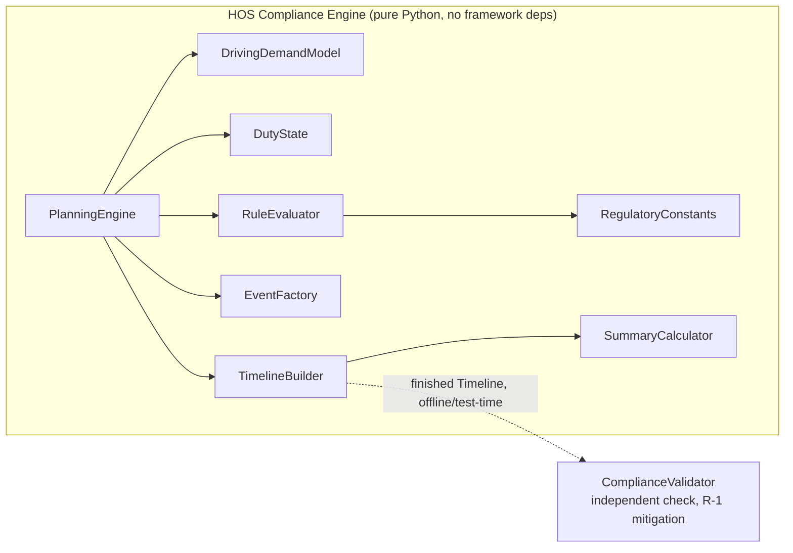
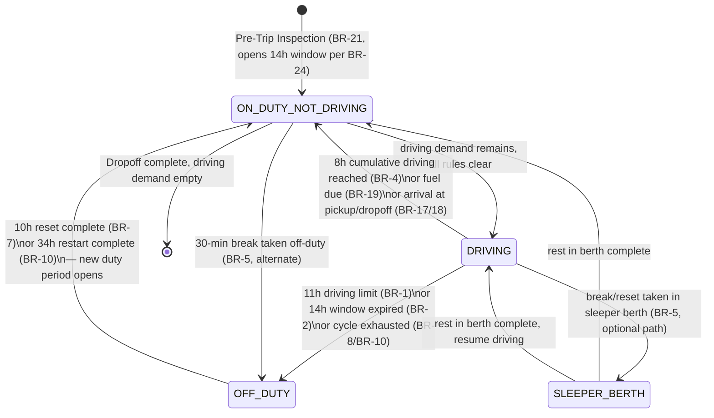
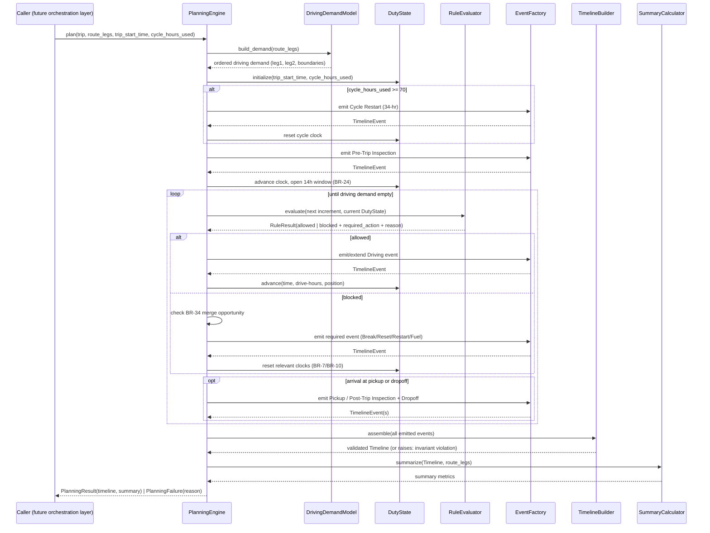
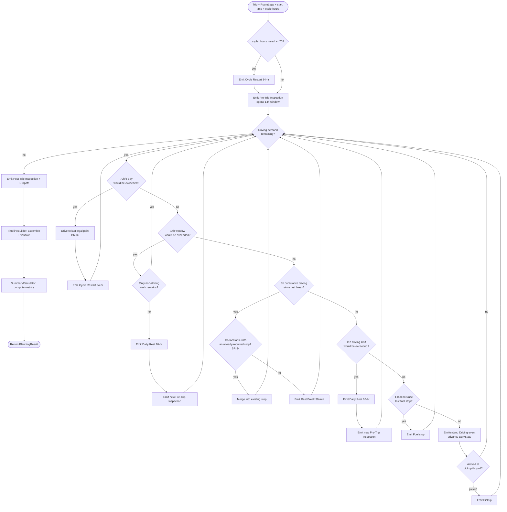

# HOS Engine Design — Truck Trip Planner

**Phase:** 4B — Architecture Design Only
**Status:** Draft for review before Phase 4C (implementation)
**Scope:** This document designs the Hours-of-Service planning engine's internal architecture, processing flow, rule catalogue, and state machine. **No rule logic, models, APIs, or frontend code is implemented in this phase.** Everything here is a design for Phase 4C to build against.

This design follows directly from `PRD.md` Section 14 (Business Rules), FR-3/FR-4, and `docs/domain-analysis.md` Sections 7–9 (Timeline as the aggregate's heart, the HOS Compliance Engine as its own bounded context, framework/DB/provider independence).

---

## 1. Inputs to the Engine

The engine is a pure function of four inputs. It has no knowledge of Django, the database, HTTP, or the routing provider (NFR-5.1, FR-3.11) — everything it needs is passed in as plain data.

| Input | Shape | Source | Notes |
|---|---|---|---|
| **Trip** (the parts the engine cares about) | `current_location_text`, `pickup_location_text`, `dropoff_location_text` (for event location labels only — the engine does no geocoding) | Persisted `Trip` row (Phase 2B) | The engine reads only the fields it needs to label events; it never touches routing or persistence directly. |
| **RouteLegs** | An ordered pair: leg 1 (current→pickup) and leg 2 (pickup→dropoff), each with `distance_miles`, `duration_minutes`, and enough geometry to interpolate a position/place-name at a given mileage | Persisted `RouteLeg` rows, produced by `RoutingService` (Phase 4A) | The engine assumes routing already succeeded — an unroutable trip never reaches this engine (see Edge Cases, §7). |
| **Trip start time** | A single datetime | `Trip.trip_start_time` | Anchors the entire simulation clock (A-17: truck departs immediately at this time). |
| **Cycle hours used** | A decimal, 0–70 | `Trip.cycle_hours_used` | The driver's on-duty hours already accumulated in the current rolling 8-day window (A-18: assumed to arrive with fresh 11-/14-hour clocks — see Assumptions). |

**Precondition the engine assumes, but does not itself enforce:** inputs have already passed FR-1/FR-2 validation (cycle hours in `[0, 70]`, a real route exists). The engine's job starts only once those are true.

---

## 2. Outputs

| Output | Shape | Consumed by |
|---|---|---|
| **Timeline events** | An ordered, contiguous, non-overlapping list of `TimelineEvent`-shaped records: `sequence`, `start_time`, `end_time`, `duty_status`, `event_type`, `location_name` (+ coordinates), `distance_miles` (driving events only), `reason` | Persisted as `TimelineEvent` rows (Phase 2B schema); read by the Log & Reporting Generation context (`docs/domain-analysis.md` §9) to derive Stops, DailyLogs, LogRemarks |
| **Duty status transitions** | Implicit in the Timeline — each event boundary *is* a duty status transition. No separate structure; the Timeline is the single source of truth (`docs/domain-analysis.md` §3.4). |
| **Summary metrics** | Total distance, total driving hours, total elapsed duration, projected arrival, day count, stop-type counts, cycle hours consumed/remaining, restart-required flag | A thin aggregation computed *after* the Timeline is finished (see `SummaryCalculator`, §3) — this is the same data `TripSummary` needs (`docs/domain-analysis.md` §3.9), produced here as a convenience rather than recomputed twice |
| **PlanningFailure** (the alternative to the three outputs above) | A reason string + the rule that could not be satisfied | Returned instead of a Timeline when BR-37/NFR-2.4 applies — the engine never returns a non-compliant plan |

---

## 3. Engine Architecture

The engine is a small pipeline of single-responsibility components. None of them know about Django, HTTP, or the routing provider — they operate purely on the DTOs passed between them.



| Component | Responsibility | Notes |
|---|---|---|
| **PlanningEngine** | The single public entry point and orchestrator. Runs the simulation loop (§4), delegating every decision to the other components. Contains no rule logic itself — it only sequences calls and reacts to their results. | Analogous to a "conductor" — the only component anything outside the engine ever calls. |
| **DrivingDemandModel** | Translates the two `RouteLegs` into a single ordered "driving demand" queue — an abstract amount of drive-time/distance to consume, annotated with the mile-markers where Pickup and Dropoff must be inserted (end of leg 1, end of leg 2). Isolates route-to-drive-time translation so nothing downstream needs geography awareness beyond "how much of this leg is left." | Keeps `RuleEvaluator` and `DutyState` fully decoupled from `RouteLeg`'s schema. |
| **DutyState** | An immutable-per-step value object holding the driver's clock state at a moment in time: current clock time, current duty status, cumulative driving hours since the last qualifying break, elapsed hours since the current 14-hour window opened, cumulative on-duty hours in the rolling 70-hour/8-day window, hours accumulated toward a 10-hour or 34-hour reset, current position (leg + mile marker). | This is the "memory" threaded through every iteration of the simulation loop — each step produces a *new* `DutyState`, never mutates in place, which is what makes the engine's determinism (FR-3.12) easy to reason about and to test. |
| **RegulatoryConstants** | The single place every numeric rule constant lives (11h, 14h, 8h cumulative, 30min, 10h, 34h, 70h/8-day, 1000mi, 1h pickup, 1h dropoff, 30min fuel, 15min inspections), each named and cross-referenced to its CFR section or PRD assumption ID. | Satisfies NFR-5.2 directly. `RuleEvaluator` reads from here; nothing hardcodes a number anywhere else. |
| **RuleEvaluator** | A set of independent rule checks (one per BR-1–BR-11, BR-19), each of which inspects the current `DutyState` plus the next proposed driving increment and returns a `RuleResult`. Checks run in a fixed precedence order (§4, driven by BR-33's "legal first" policy). This is where every BR-1 through BR-11 and BR-19 rule from §5 lives. | Each rule is a small, independently testable unit — no rule needs to know another rule exists, only its position in the evaluation order. |
| **RuleResult** | The DTO a rule check (or the evaluator as a whole) returns: whether driving may continue for the proposed increment, and if not, which mandatory action is required next (30-min break / 10-hour reset / 34-hour restart / fuel stop), plus the human-readable reason and the rule ID that triggered it (feeds FR-4.2's mandatory `reason` field and BR-33/US-22 traceability). | Never itself performs a side effect — purely a description of "what must happen next and why." |
| **EventFactory** | Turns a `RuleResult` or an operational trigger (pickup arrival, dropoff arrival, fuel due, inspection due) into a concrete, fully-formed timeline event: resolved start/end time, interpolated location (place name + coordinates at the current mile marker), duty status, event type, and reason string. | Isolates "how an event is phrased and located" from "when an event is needed" — a presentation-adjacent concern kept out of `RuleEvaluator`. |
| **TimelineBuilder** | Accumulates the ordered events produced by the simulation loop into the final Timeline and validates the aggregate invariant: contiguous, gap-free, non-overlapping, spanning trip start to delivery completion exactly (FR-4.1, FR-4.5). | The last stop before a result leaves the engine boundary. If this validation ever fails, that is a bug in the engine, not a legitimately unplannable trip — see §7. |
| **SummaryCalculator** | A pure aggregation over the finished Timeline + Route: distance, driving hours, elapsed duration, arrival time, day count, stop-type counts, cycle accounting, restart flag. Runs strictly after `TimelineBuilder` finishes. | Kept as a distinct, final step — not folded into the simulation loop — because summary metrics are a *projection* over the Timeline (`docs/domain-analysis.md` §3.9), not a decision the simulation needs to make. |
| **ComplianceValidator** *(supporting, not part of the runtime pipeline)* | A second, independently-implemented pass that re-walks a *finished* Timeline and asserts no BR-1–BR-11/BR-19 rule was violated. | This is the PRD's own mitigation for R-1 ("a plausible-looking plan can be illegal") — it must be a separate code path from `RuleEvaluator` so a shared bug can't hide from it. Used by the acceptance test suite (AC-6–AC-16), not invoked on the production request path. |
| **PlanningResult / PlanningFailure** | The engine's outer return type: either `PlanningResult(timeline, summary)` or `PlanningFailure(reason, rule_id)` — never a partial or non-compliant Timeline (BR-37, NFR-2.4). | The only two possible shapes `PlanningEngine.plan(...)` can return. |

---

## 4. Processing Flow

Step-by-step, how one trip moves through the engine:

1. **Assemble inputs.** `PlanningEngine` receives the Trip's three location labels, `trip_start_time`, `cycle_hours_used`, and the two persisted `RouteLegs`.
2. **Build driving demand.** `DrivingDemandModel` converts the two legs into one ordered demand queue, marking the boundary between them as "arrival at pickup" and the end of the second leg as "arrival at dropoff" (BR-23).
3. **Initialize DutyState.** `current_time = trip_start_time`; `cumulative_cycle_hours = cycle_hours_used`; all other clocks (drive-since-break, elapsed-in-window, since-last-fuel) start at zero; position = start of leg 1.
4. **Pre-flight cycle check.** If `cumulative_cycle_hours >= 70`, `RuleEvaluator` immediately reports "cycle exhausted" before any driving is attempted; `EventFactory` emits a **Cycle Restart (34-hr)** event at trip start, and `DutyState`'s cycle clock resets to zero (BR-10, AC-11, EC-4/EC-44).
5. **Open the duty period.** `EventFactory` emits a **Pre-Trip Inspection** event (15 min, On Duty–Not Driving). Per BR-24, the 14-hour window opens at the *start* of this event, not at the first driving minute.
6. **Enter the simulation loop**, which repeats until the driving demand queue is empty:
   1. `PlanningEngine` asks `RuleEvaluator` to evaluate the *next* proposed driving increment (up to the smaller of: remainder of the current leg, or the distance to the nearest constraint boundary) against the current `DutyState`.
   2. `RuleEvaluator` checks constraints in this fixed precedence order (BR-33 — legal first, and the order in which a violation would first become binding):
      1. **70-hour/8-day cycle** (BR-8–BR-11) — would this increment push cumulative on-duty time over 70 hours?
      2. **14-hour window** (BR-2, BR-3, BR-24) — would this increment extend past the 14th hour since the window opened?
      3. **8-cumulative-hour break trigger** (BR-4–BR-6) — has 8 cumulative driving hours elapsed since the last qualifying 30-minute break?
      4. **11-hour driving limit** (BR-1, BR-7) — would this increment push driving time past 11 hours since the last 10-hour reset?
      5. **1,000-mile fuel interval** (BR-19) — is a fuel stop due before this increment's distance is fully consumed?
   3. **If every check clears:** `RuleEvaluator` returns `RuleResult(allowed=True)`. `EventFactory` extends (or opens) a **Driving** event for the allowed increment. `DutyState` advances: clock time, drive-since-break, window-elapsed, cycle total, and position all move forward by that increment.
   4. **If a check blocks continued driving:** `RuleEvaluator` returns `RuleResult(allowed=False, required_action=..., reason=..., rule_id=...)`. Before acting, `PlanningEngine` checks BR-34: is there already a required stop (fuel, pickup, dropoff) reachable within the same window that can absorb this requirement? If yes, the two are merged into one event rather than scheduled separately (BR-6, BR-34). `EventFactory` then emits the required event (**Rest Break (30-min)**, **Daily Rest (10-hr)**, **Cycle Restart (34-hr)**, or **Fuel**), and `DutyState`'s relevant clocks reset per BR-7/BR-10 once the event completes. The loop then re-evaluates from the (now rested) state.
   7. **On arrival at the end of leg 1:** `EventFactory` emits a **Pickup** event (BR-17, 1 hour, On Duty–Not Driving); the demand queue switches to leg 2.
   8. **On arrival at the end of leg 2:** `EventFactory` emits a **Post-Trip Inspection** (BR-22, closing the duty period) followed by a **Dropoff** event (BR-18, 1 hour, On Duty–Not Driving). The loop terminates.
7. **Assemble and validate the Timeline.** `TimelineBuilder` collects every event emitted above, in order, and asserts contiguity/non-overlap/full coverage (FR-4.1, FR-4.5). A failure here indicates an engine defect, not an unplannable trip (see §7).
8. **Compute summary metrics.** `SummaryCalculator` derives the headline numbers from the finished Timeline + Route.
9. **Return.** `PlanningEngine` returns `PlanningResult(timeline, summary)` to the caller (a future orchestration layer, out of scope for this phase) — or `PlanningFailure` if BR-37's last-resort condition is ever reached.

---

## 5. FMCSA Rules — Full Catalogue

Every rule from PRD §14, with its trigger, the action the engine takes, and the resulting timeline event(s).

### 5.1 Driving and duty limits

| Rule | Trigger | Action | Resulting Timeline Event |
|---|---|---|---|
| **BR-1** — 11-hour driving limit | Cumulative driving time since the last qualifying 10-hour off-duty period would exceed 11.0 hours | Stop driving at exactly 11.0 hours; require a 10-hour off-duty reset before more driving | Driving event capped at 11h; followed by **Daily Rest (10-hr)** |
| **BR-2** — 14-hour driving window | The proposed driving increment would occur more than 14.0 consecutive hours after the window opened (BR-24) | Stop driving at the 14th hour boundary regardless of remaining break time; require a 10-hour reset | Driving event capped at the window boundary; followed by **Daily Rest (10-hr)** |
| **BR-3** — Non-driving work permitted past 14h | Window has expired but only non-driving work (e.g., Dropoff) remains | Non-driving events (On Duty–Not Driving) may proceed past the 14-hour mark; only Driving is blocked | The non-driving event (e.g., **Dropoff**) proceeds unblocked; still accrues against the 70-hour cycle |
| **BR-4** — 30-minute break trigger | Cumulative driving hours since the last qualifying non-driving block ≥ 30 consecutive minutes reaches 8.0 hours | Block further driving until a 30-minute non-driving block is satisfied | **Rest Break (30-min)** event, duty status Off Duty / Sleeper Berth / On Duty–Not Driving (BR-5) |
| **BR-5** — Break may be any non-driving status | A 30-min break is being scheduled | The break's duty status may be Off Duty, Sleeper Berth, or On Duty–Not Driving — engine default is On Duty–Not Driving unless merged with an Off-Duty-qualifying stop | **Rest Break (30-min)** |
| **BR-6** — Existing stop satisfies the break | A qualifying non-driving stop (e.g., Fuel) of ≥ 30 consecutive minutes already falls within the window where a break is due | Do not schedule a second, separate break — the existing stop counts | The **Fuel** (or other qualifying) event absorbs the break requirement; no redundant event is created |
| **BR-7** — 10-hour reset | Driver completes 10 consecutive off-duty hours | Reset both the 11-hour driving clock and the 14-hour window to zero; open a new duty period | **Daily Rest (10-hr)**, followed by a new **Pre-Trip Inspection** opening the next duty period |
| **BR-8** — 70-hour/8-day limit | Cumulative on-duty time (all statuses, not just driving) in the rolling 8-day window would reach 70.0 hours | Block further driving; only a 34-hour restart clears this | Driving stops at the boundary; **Cycle Restart (34-hr)** inserted |
| **BR-9** — Rolling 70-hour window | A new day is added to the window | The oldest day's on-duty hours drop out of the rolling total | No standalone event — an accounting rule applied to `DutyState`'s cycle clock each simulated day boundary |
| **BR-10** — 34-hour restart | Driver accumulates 34+ consecutive off-duty hours | Reset the 70-hour cycle to zero | **Cycle Restart (34-hr)** |
| **BR-11** — Cycle limit blocks driving only | 70-hour limit reached | Only Driving is blocked; non-driving work (Dropoff, paperwork) may still proceed | Non-driving events proceed; Driving is blocked until restart |

### 5.2 Duty status classification

| Rule | Trigger | Action | Resulting Timeline Event |
|---|---|---|---|
| **BR-12** — Every minute classified | Continuously | Every simulated minute belongs to exactly one of the four duty statuses | Enforced structurally by `TimelineBuilder`'s gap-free invariant, not a discrete event |
| **BR-13** — Driving definition | Truck in motion at the controls | Classify as Driving | **Drive** event type |
| **BR-14** — On Duty (Not Driving) definition | Inspecting, servicing, fueling, loading/unloading, paperwork | Classify as On Duty–Not Driving | **Fuel**, **Pickup**, **Dropoff**, **Pre-/Post-Trip Inspection** event types |
| **BR-15** — Off Duty definition | Driver relieved of all duty, free to pursue personal activities | Classify as Off Duty | **Daily Rest (10-hr)** / **Cycle Restart (34-hr)** (per A-10 default) |
| **BR-16** — Sleeper Berth is a location, not an activity | Rest taken in the sleeper compartment | Classify as Sleeper Berth instead of Off Duty when explicitly modeled | Not used by the v1 engine's default policy (see Assumptions) but a valid target duty status for BR-5's break options |

### 5.3 Trip-specific operational rules

| Rule | Trigger | Action | Resulting Timeline Event |
|---|---|---|---|
| **BR-17** — Pickup duration | Arrival at the pickup location (end of leg 1) | Consume exactly 1 hour, On Duty–Not Driving | **Pickup** |
| **BR-18** — Dropoff duration | Arrival at the dropoff location (end of leg 2) | Consume exactly 1 hour, On Duty–Not Driving | **Dropoff** |
| **BR-19** — Fuel interval | 1,000 miles driven since trip start or the last fuel stop | Insert a fuel stop before the 1,000-mile mark is exceeded | **Fuel** |
| **BR-20** — Fuel stop duration | A fuel stop is scheduled | Consume 30 minutes, On Duty–Not Driving | **Fuel** |
| **BR-21** — Pre-trip inspection | Start of each duty period | Consume 15 minutes, On Duty–Not Driving, before the first driving segment | **Pre-Trip Inspection** |
| **BR-22** — Post-trip inspection | End of each duty period (last driving segment complete) | Consume 15 minutes, On Duty–Not Driving, after the last driving segment | **Post-Trip Inspection** |
| **BR-23** — Fixed 3-point route | Every trip | Route is always current→pickup→dropoff, exactly two legs | Structural input constraint, enforced by `DrivingDemandModel`, not a rule check |
| **BR-24** — 14-hour window start | Start of the pre-trip inspection | The 14-hour window clock starts here, not at first driving minute | Reflected in `DutyState`'s window-elapsed clock from the **Pre-Trip Inspection** event's start time |

### 5.4 Log sheet rules

These govern the downstream Log & Reporting Generation context (`docs/domain-analysis.md` §9), not the engine itself — listed here for completeness since they constrain what the Timeline must supply.

| Rule | What the engine must guarantee so this rule can be satisfied downstream |
|---|---|
| **BR-25** — One log sheet per calendar day | Every `TimelineEvent` carries exact, unambiguous start/end timestamps so midnight-boundary slicing is possible |
| **BR-26** — Fixed 4-row order | The engine's `duty_status` values map 1:1 onto the four fixed rows; no fifth status is ever emitted |
| **BR-27** — 15-minute grid increments | Not an engine concern — a rendering-time concern. The engine stores exact times, never pre-rounded to the grid |
| **BR-28** — Daily totals sum to 24h | Guaranteed by the engine's own gap-free invariant (FR-4.1) — if the Timeline has no gaps, any day-slice of it sums to 24h by construction |
| **BR-29** — Remarks at every status change | Every engine-emitted event carries a `location_name` and `reason`, which is exactly what a remark needs |
| **BR-30** — Total miles per day | Derivable from the `distance_miles` field the engine attaches to each Driving event |
| **BR-31** — Vertical connector at status change | Rendering concern only |
| **BR-32** — N-day trip → N sheets | Guaranteed by the same gap-free/full-coverage invariant as BR-28 |

### 5.5 Planning policy rules (product decisions, not regulation)

| Rule | Trigger | Action | Resulting Timeline Event |
|---|---|---|---|
| **BR-33** — Legal first, fast second | Any point where a scheduling choice exists | `RuleEvaluator`'s precedence order (§4, step 6.2) always resolves in favor of the larger compliance margin, never the earlier arrival | Governs *which* event gets scheduled when multiple are technically valid; not itself an event |
| **BR-34** — Merge co-located requirements | A required break/reset coincides with an already-required stop | `PlanningEngine` merges them into one event rather than scheduling both | A single event serving two purposes (e.g., **Fuel** absorbing the 30-min break) |
| **BR-35** — No zero-duration stops | Any point a stop would be scheduled | `EventFactory` never emits an event with `start_time == end_time`; a same-location leg (EC-1) contributes no event rather than a zero-length one | N/A — governs event *suppression* |
| **BR-36** — Restart at last legal point | Cycle would be exhausted mid-leg | `RuleEvaluator` stops driving at the last point still within the 70-hour budget, not at the point of violation | Driving event capped at the legal boundary; **Cycle Restart (34-hr)** follows |
| **BR-37** — Never return a non-compliant plan | The engine cannot find any legal continuation | Return `PlanningFailure` with the blocking rule and reason instead of a Timeline | N/A — this is the engine's escape hatch, not an event |

---

## 6. State Machine

### 6.1 Duty statuses

Exactly four, per BR-12: `OFF_DUTY`, `SLEEPER_BERTH`, `DRIVING`, `ON_DUTY_NOT_DRIVING`.

### 6.2 Transition table

| From | To | Triggered by |
|---|---|---|
| *(trip start)* | `ON_DUTY_NOT_DRIVING` | Pre-Trip Inspection opens the first duty period |
| `ON_DUTY_NOT_DRIVING` | `DRIVING` | Inspection/Pickup/Dropoff/Fuel/Break complete and driving demand remains |
| `DRIVING` | `ON_DUTY_NOT_DRIVING` | 8-cumulative-hour break trigger (as On Duty variant), fuel due, arrival at pickup/dropoff, or 11-hour/14-hour limit reached and only non-driving work remains |
| `DRIVING` | `OFF_DUTY` | 11-hour or 14-hour limit reached and a 10-hour reset is required; or cycle exhausted (34-hour restart, modeled as Off Duty per A-10) |
| `DRIVING` | `SLEEPER_BERTH` | A break or reset is explicitly taken in the sleeper berth (BR-5) — available in the model, not used by the v1 engine's default policy |
| `OFF_DUTY` | `ON_DUTY_NOT_DRIVING` | 10-hour or 34-hour reset completes; next duty period opens with a new Pre-Trip Inspection |
| `ON_DUTY_NOT_DRIVING` | `OFF_DUTY` | A 30-minute break is taken as Off Duty rather than On Duty–Not Driving (BR-5, alternate path) |
| `SLEEPER_BERTH` | `ON_DUTY_NOT_DRIVING` / `DRIVING` | Reset or break in the sleeper berth completes |
| *(any driving-eligible status)* | *(engine halts)* | Driving demand queue empty after Dropoff — Timeline complete |

### 6.3 Example run (matches the pattern in the task prompt)

```
OFF_DUTY (implicit, pre-trip)
  → ON_DUTY_NOT_DRIVING   (Pre-Trip Inspection, 15 min)
  → DRIVING               (leg 1 toward pickup)
  → ON_DUTY_NOT_DRIVING   (Pickup, 1 hr)
  → DRIVING               (leg 2 toward dropoff, until 8 cumulative driving hours)
  → ON_DUTY_NOT_DRIVING   (Rest Break, 30 min)
  → DRIVING               (resume, until 11-hour limit)
  → OFF_DUTY              (Daily Rest, 10 hr)
  → ON_DUTY_NOT_DRIVING   (Pre-Trip Inspection, new duty period)
  → DRIVING               (remainder of leg 2)
  → ON_DUTY_NOT_DRIVING   (Post-Trip Inspection, then Dropoff, 1 hr)
```

### 6.4 State diagram



---

## 7. Edge Cases

| Edge case | Engine behavior | Rule basis |
|---|---|---|
| **Trip shorter than one day** | No 30-min break, no 10-hour reset, no fuel stop triggered if under all thresholds; Timeline is Pre-Trip → Drive → Post-Trip → Dropoff only. Single DailyLog downstream. | EC-40; BR-4/BR-1 simply never trigger |
| **Multiple required breaks in one trip** | Simulation loop naturally repeats the "drive until blocked, insert required event, resume" cycle as many times as needed — no special-casing required. Each 30-min break, 10-hour reset, or (if the cycle is exhausted more than once) 34-hour restart is surfaced individually in the summary's stop counts. | EC-21 (multiple restarts), general loop design in §4 |
| **Insufficient cycle hours at trip start** (`cycle_hours_used` at or near 70) | Handled by the pre-flight check (§4 step 4): a Cycle Restart is inserted *before* any driving, not treated as an error. `cycle_hours_used > 70` is rejected upstream by input validation (FR-1.5) and never reaches the engine. | EC-3, EC-4, EC-5; BR-10, AC-11 |
| **Cycle exhausted mid-trip** | `RuleEvaluator` stops driving at the last point still inside the 70-hour budget (not the point of violation), then a 34-hour restart is inserted (BR-36). Arrival time shifts accordingly and the restart is flagged prominently in the summary (FR-7.4). | EC-20, EC-42; BR-36 |
| **Destination reached before a required break is due** | The break simply never triggers — `RuleEvaluator`'s 8-cumulative-hour check only fires if the threshold is actually crossed. No break is force-inserted near the end of a short trip. | Implicit in §4's threshold-based (not schedule-based) design |
| **14-hour window expires with only non-driving work (e.g., Dropoff) remaining** | BR-3 explicitly permits this: Driving is blocked, but the Dropoff (On Duty–Not Driving) proceeds since the truck is already at the delivery location. | EC-18; BR-3 |
| **Cycle limit reached at the exact moment of delivery** | Dropoff completes normally; summary reports 0 hours remaining in the cycle. No restart is needed since no further driving is required. | EC-19 |
| **A required break falls at the exact instant the 14-hour window expires** | The 10-hour reset (which the window expiry itself triggers) supersedes the smaller 30-minute break — scheduling both would be redundant and would violate BR-35 (no pointless stops). | EC-25 |
| **Unroutable trip** | Never reaches this engine. `RoutingService` (Phase 4A) raises `RouteNotFoundError` before a Trip has any `RouteLegs` to hand to `PlanningEngine`. The engine's own precondition (§1) is simply not met, and it is never invoked. If it were ever invoked with zero legs, `DrivingDemandModel` would raise a defensive error rather than silently produce an empty Timeline (consistent with BR-37/NFR-2.4's "never emit a non-compliant — or in this case, meaningless — plan"). | EC-10; architectural boundary between Routing and HOS Planning contexts (`docs/domain-analysis.md` §9) |
| **Trip starts at 23:45** | No special handling needed at the engine level — the Timeline simply contains a Pre-Trip Inspection event starting at 23:45. Splitting that event across the midnight boundary into two DailyLogs is the Log & Reporting Generation context's job, not this engine's. | EC-26 |
| **An event spans midnight** | The engine emits one continuous event with an exact start/end time that happens to cross midnight (e.g., a 10-hour reset from 22:00 to 08:00). It does **not** split the event itself — splitting for per-day log rendering is explicitly out of this engine's scope (`docs/domain-analysis.md` §9, Log & Reporting Generation). | EC-27, EC-31 |
| **A 34-hour restart spans three calendar days** | Same principle — one continuous Off Duty event; downstream slicing produces a fully-off-duty middle day. | EC-28 |
| **Two duty-status changes within the same 15-minute grid cell** | Irrelevant to the engine — it always stores exact timestamps, never grid-quantized ones. Grid quantization is a rendering-time concern for the log sheet renderer. | EC-32; BR-27 |

---

## 8. Mermaid Diagrams

### 8.1 State diagram

See §6.4 above.

### 8.2 Sequence diagram — one call into the engine



### 8.3 Processing flow (decision-oriented)



---

## Assumptions and Ambiguities Carried Into Phase 4C

1. **Break duty status default.** BR-5 permits a 30-minute break to be Off Duty, Sleeper Berth, or On Duty–Not Driving. This design defaults to On Duty–Not Driving for a standalone break (simplest, and consistent with A-10's "Off Duty is the simpler default" reasoning for the 10-hour reset), only using the merge path (BR-6/BR-34) when a qualifying stop already exists. The PRD does not explicitly state this default for the *30-minute* break specifically (A-10 only addresses the 10-hour reset) — Phase 4C should confirm this choice.

2. **Duty-period granularity for pre-/post-trip inspections.** BR-21/BR-22 say inspections bracket "each duty period," but the PRD does not define precisely where one duty period ends and the next begins for a multi-day trip. This design assumes a duty period is bounded by any qualifying 10-hour-or-longer off-duty block (i.e., every 10-hour reset or 34-hour restart both closes one duty period and opens the next, each with its own 15-minute inspection pair). An alternative reading — inspections occur only once at the absolute start and end of the whole trip — would be simpler but seems less faithful to "every real log" (A-16's stated rationale). **This is the single most consequential ambiguity in this design** since it changes how many inspection events appear in a multi-day trip; it should be confirmed before Phase 4C.

3. **Precedence order among simultaneously-binding rules** (§4 step 6.2) is this document's own construction, informed by BR-33 ("legal first") but not explicitly specified by the PRD as an ordered list. The PRD states the individual rules and a general tie-breaking philosophy (BR-33, BR-34) but never enumerates "check cycle before window before break before driving-limit before fuel" as an ordered sequence. This document proposes that order because a broader constraint (70-hour cycle) becoming binding should always take precedence over a narrower one (11-hour limit) — but Phase 4C should treat this ordering as a design decision open to review, not a transcribed requirement.

4. **Fuel-interval measurement basis.** BR-19 measures "1,000 miles since the last fuel stop or trip start." This design treats fuel distance as continuous across duty-status changes (i.e., a 10-hour reset does not reset the fuel odometer, only a real fuel stop does) — the PRD doesn't explicitly say whether an off-duty period should reset it, but nothing in Part 395 ties fuel range to duty status, so this reading seems safe.

5. **`RouteLeg`-to-position interpolation** (used by `EventFactory` to label a stop's location, and to know exactly where along a leg a rule boundary falls) assumes route geometry can be interpolated at an arbitrary mileage to produce a place name. Per A-19 (`docs/domain-analysis.md`), this yields the *routed position*, not a real named truck stop — carried forward unchanged from the routing layer's own documented limitation.

6. **Engine failure (`PlanningFailure`, BR-37) is expected to be rare-to-never in v1.** Because a 34-hour restart is always available to clear an exhausted cycle, and the ruleset as modeled has no scenario where restarting fails to eventually produce a legal continuation, this design treats `PlanningFailure` primarily as a defensive guard against an internal engine defect (e.g., `TimelineBuilder`'s invariant check failing) rather than an expected response to any *valid* input. The PRD's own Non-Goals (no adverse driving conditions, no exceptions) reinforce that every validated input should be plannable. Phase 4C should confirm there is no legitimate input shape this design has missed that would require `PlanningFailure` as a normal-path outcome.

7. **Sleeper Berth is modeled but not used by the v1 default policy.** Per A-10 and A-7 (no sleeper-berth split), the engine's default behavior never *chooses* Sleeper Berth for a reset or break — it's included in the state machine (§6) only because BR-5/BR-16 make it a structurally valid target, not because v1's scheduling policy will ever select it. This keeps the door open for the sleeper-berth-split feature (PRD §24.1) without the v1 engine needing to reason about it.
